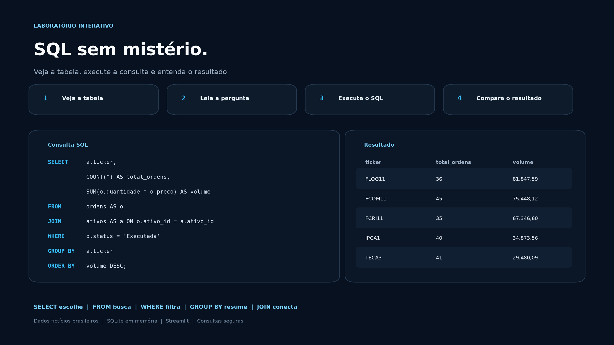

# SQL sem Mistério: Laboratório Visual


Aplicação educacional para quem nunca consultou um banco de dados. O usuário
conhece as tabelas, lê uma pergunta de negócio, modifica a consulta SQL e vê o
resultado acompanhado de uma explicação em linguagem simples.



## Problema

Materiais introdutórios de SQL frequentemente começam pela sintaxe e pressupõem
que o aluno já entende tabelas, relacionamentos e o formato de uma consulta. Para
quem está começando, comandos como `SELECT`, `FROM` e `WHERE` aparecem como
palavras isoladas, sem conexão visual com os dados.

Este laboratório inverte essa ordem:

1. apresenta a tabela de origem;
2. explica a pergunta que será respondida;
3. permite editar e executar a consulta;
4. traduz cada cláusula;
5. mostra o resultado produzido.

## Experiência de aprendizagem

| Etapa | Conceitos | Resultado esperado |
|---|---|---|
| 1 | `SELECT`, `FROM`, `LIMIT` | Escolher colunas e controlar a saída |
| 2 | `WHERE`, `AND` | Filtrar linhas por condições |
| 3 | `ORDER BY`, `ASC`, `DESC` | Ordenar e priorizar registros |
| 4 | `COUNT`, `SUM`, `AVG`, `GROUP BY` | Transformar linhas em indicadores |
| 5 | `JOIN`, `ON`, aliases | Combinar tabelas relacionadas |
| 6 | `CASE WHEN` | Traduzir regras de negócio em categorias |
| Prática | Três desafios graduais | Resolver problemas e validar o resultado |
| Exploração | Playground somente para leitura | Criar consultas próprias com segurança |

## Funcionalidades

- seis aulas progressivas, do primeiro `SELECT` ao `CASE WHEN`;
- visualização da tabela antes da consulta;
- tradução das cláusulas SQL em português;
- editor de consultas dentro do Streamlit;
- desafios corrigidos pelo resultado, não por cópia de código;
- mapa das quatro tabelas e suas chaves de relacionamento;
- playground que aceita apenas uma consulta `SELECT` ou `WITH`;
- bloqueio de comandos que alteram o banco;
- progresso temporário durante a sessão;
- interface responsiva em tema escuro.

## Cenário dos dados

O banco representa uma instituição brasileira fictícia e possui quatro tabelas:

| Tabela | Linhas | Conteúdo |
|---|---:|---|
| `clientes` | 60 | Localização, perfil de investidor e data de cadastro |
| `contas` | 80 | Tipo de conta, saldo e status |
| `ativos` | 12 | Produtos de investimento e setores fictícios |
| `ordens` | 520 | Compras, vendas, quantidades, preços e status |

Todos os registros são sintéticos e reproduzíveis por meio de uma semente fixa.
O projeto não utiliza dados, regras ou sistemas internos da B3 nem de qualquer
instituição financeira.

O dicionário e os relacionamentos estão em
[docs/modelo_de_dados.md](docs/modelo_de_dados.md).

## Exemplo explicado

```sql
SELECT nome, cidade
FROM clientes
WHERE uf = 'SP'
ORDER BY nome;
```

Leitura em linguagem simples:

- `SELECT nome, cidade`: mostre somente essas duas colunas;
- `FROM clientes`: busque os dados na tabela de clientes;
- `WHERE uf = 'SP'`: mantenha apenas as linhas de São Paulo;
- `ORDER BY nome`: organize o resultado em ordem alfabética.

## Como executar

### 1. Crie e ative um ambiente virtual

```bash
python3 -m venv .venv
source .venv/bin/activate
```

### 2. Instale as dependências

```bash
python -m pip install --upgrade pip
python -m pip install -r requirements.txt
```

### 3. Inicie a aplicação

```bash
python -m streamlit run app.py
```

Abra `http://localhost:8501` caso o navegador não seja iniciado automaticamente.

## Testes

Instale as dependências de desenvolvimento e execute:

```bash
python -m pip install -r requirements-dev.txt
python -m pytest -q
```

Os testes verificam:

- carregamento e relacionamento das tabelas;
- execução de todas as consultas das aulas;
- execução das soluções dos desafios;
- tradução das cláusulas na ordem da consulta;
- bloqueio de comandos de escrita e múltiplas instruções;
- comparação dos resultados usados na correção.

## Estrutura do repositório

```text
sql-guia-visual/
├── .streamlit/
│   └── config.toml
├── assets/
│   └── preview.png
├── data/
│   ├── ativos.csv
│   ├── clientes.csv
│   ├── contas.csv
│   └── ordens.csv
├── docs/
│   ├── decisoes_do_projeto.md
│   └── modelo_de_dados.md
├── scripts/
│   ├── gerar_dados.py
│   └── gerar_visualizacoes.py
├── src/
│   ├── content.py
│   ├── database.py
│   ├── explainer.py
│   └── validation.py
├── tests/
│   ├── test_database.py
│   ├── test_learning.py
│   └── test_validation.py
├── app.py
├── requirements-dev.txt
└── requirements.txt
```

## Decisões técnicas

- **SQLite em memória:** dispensa servidor e credenciais;
- **CSV versionado:** permite inspecionar e reproduzir os dados;
- **pandas:** apresenta resultados em tabelas legíveis;
- **validação de leitura:** impede alterações acidentais;
- **conteúdo separado do app:** facilita adicionar novas aulas;
- **pytest:** protege consultas, dados e regras de segurança.

As escolhas e limitações são detalhadas em
[docs/decisoes_do_projeto.md](docs/decisoes_do_projeto.md).

## Limitações

O projeto ensina consultas e análise. Criação de tabelas, inserção, atualização,
exclusão, permissões, índices e administração de servidores não fazem parte da
primeira versão. O dialeto utilizado é SQLite, portanto algumas funções podem
ter sintaxe diferente em PostgreSQL, SQL Server, MySQL ou BigQuery.

## Autor

**Bruno Nunes**

Ciência de Dados e Inteligência Artificial aplicada a problemas de negócio.
